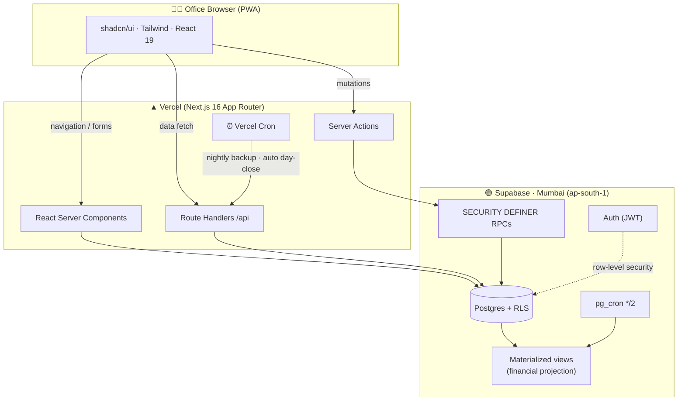
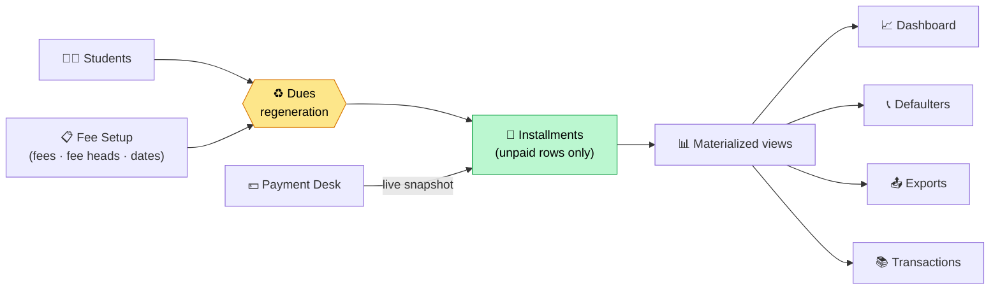
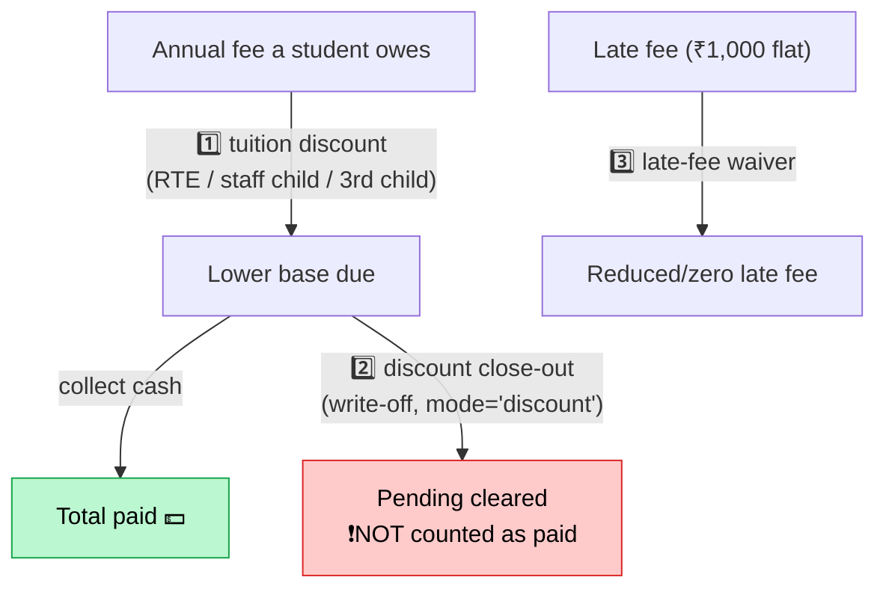
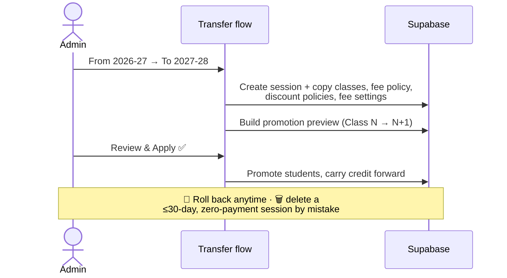

<div align="center">

# 🏫 VPPS Fee Management

### Internal fee-office platform for **Shri Veer Patta Senior Secondary School**

*One school · one tenant · built for the office, accounts team, and admins — not parents, not the public.*

[](https://nextjs.org/)
[](https://react.dev/)
[](https://www.typescriptlang.org/)
[](https://supabase.com/)
[](https://tailwindcss.com/)
[](https://vitest.dev/)
[](https://schoolfees-two.vercel.app)

🔗 **Live app:** [schoolfees-two.vercel.app](https://schoolfees-two.vercel.app) · 📦 **Repo:** [github.com/veerpatta/schoolfees](https://github.com/veerpatta/schoolfees)

</div>

---

## ✨ TL;DR

> A fast, **append-only, audit-ready** fee desk that replaces the office Excel workbook.
> Staff maintain **Students** and **Fee Setup**; everything else — dues, dashboards,
> defaulters, receipts, exports — derives automatically. Money records are **immutable**;
> corrections flow through adjustments. It's **production-live** for AY 2026-27 with real data. 🟢

| | |
|---|---|
| 🎯 **Audience** | Office staff, accounts team, school admins (internal only) |
| 🧾 **Core job** | Collect fees, print receipts, track dues, chase defaulters |
| 🔒 **Promise** | Posted payments/receipts are never edited in place |
| 🔄 **Magic** | Change a fee → unpaid dues update everywhere, no manual sync |
| ☁️ **Stack** | Next.js 16 (App Router) · Supabase (Postgres + RLS, Mumbai) · Vercel |

---

## 🧭 Table of Contents

- [🏗️ Architecture](#️-architecture)
- [🔑 The one rule: Source of Truth](#-the-one-rule-source-of-truth)
- [🧩 Modules](#-modules)
- [👥 Roles & Access](#-roles--access)
- [💰 Financial integrity (read this)](#-financial-integrity-read-this)
- [🔁 Year-end: Transfer to Next Session](#-year-end-transfer-to-next-session)
- [🤖 Automation (cron)](#-automation-cron)
- [📤 Exports (incl. the AI bundle)](#-exports-incl-the-ai-bundle)
- [🧮 Fee engine internals](#-fee-engine-internals)
- [🚀 Quick start](#-quick-start)
- [🔧 Environment variables](#-environment-variables)
- [🗄️ Database & migrations](#️-database--migrations)
- [✅ Quality gates](#-quality-gates)
- [🛡️ Hard safety rules](#️-hard-safety-rules)
- [📚 Docs map](#-docs-map)

---

## 🏗️ Architecture



**Why it's shaped like this**

- 🧠 **Server-first** — RSC + Server Actions keep logic and secrets on the server; the browser only renders.
- 🔐 **Two-layer auth** — app-layer guards (`requireStaffPermission`) *and* Postgres RLS. Defense in depth.
- ⚡ **Read/write split** — writes hit live RPCs; heavy dashboards read pre-computed **materialized views** kept fresh on every write (with a 2-min cron backstop, see [Automation](#-automation-cron)).

---

## 🔑 The one rule: Source of Truth

> **Students + Fee Setup are canonical. Everything else derives from them — automatically.**



- Edit a fee, fee head, or due date → only **unpaid** installments are rebuilt (paid rows are frozen — see [safety](#-financial-integrity-read-this)).
- The **Payment Desk** always previews/posts against a **live** allocation snapshot, so collection is never stale.
- Dashboards/exports refresh on every write; worst-case catch-up is **≤ 2 minutes**.

---

## 🧩 Modules

All staff modules live under `app/protected/` with a parallel three-layer shape:
`app/protected/<module>` (routes) + `components/<module>` (UI) + `lib/<module>` (domain logic).

| | Module | Route | What it does |
|---|---|---|---|
| 📊 | **Dashboard** | `/protected/dashboard` | Read-only analytics: collected, pending, %, class-wise, top defaulters |
| 👨‍🎓 | **Students** | `/protected/students` | Student master + per-student fee exceptions & discounts |
| 📋 | **Fee Setup** | `/protected/fee-setup` | Yearly policy: tuition, transport, due dates, late fee, fee heads |
| 💵 | **Payment Desk** | `/protected/payments` | The **only** place payments are posted; prints receipts |
| 📚 | **Transactions** | `/protected/transactions` | Read-only receipts, dues, ledger, class register |
| 📞 | **Defaulters** | `/protected/defaulters` | Daily call list with smart heat ranking & follow-up |
| 📤 | **Exports** | `/protected/exports` | XLSX download center + AI context bundle |
| 🛠️ | **Admin Tools** | `/protected/admin-tools` | Year transfer, refunds, day-close, settings, staff, audit |
| 🧾 | **Receipts** | `/protected/receipts` | Lookup & reprint (A4) |
| 💳 | **Finance Controls** | `/protected/finance-controls` | Auto day-close view, refunds, correction review |
| 🗂️ | **Master Data** | `/protected/master-data` | Sessions, classes, routes, fee heads, payment modes |
| 👮 | **Staff** | `/protected/staff` | Accounts & RBAC |
| 📥 | **Imports** | `/protected/imports` | Staged student import (upload → map → dry-run → commit) |

---

## 👥 Roles & Access

Five roles (`lib/auth/roles.ts`). Navigation visibility and landing routes are permission-driven.

| Role | 🏠 Lands on | Can do |
|---|---|---|
| 👑 `admin` | Dashboard | Everything |
| 🧮 `accountant` | Payment Desk | Collect, refunds, finance controls, reports |
| 🍎 `teacher` | Students | Students, dues, defaulters (read payments) |
| 📞 `fee_collector` | Defaulters | Follow-up + student reads |
| 👀 `view_only` | Dashboard | Read-only |

> Legacy aliases still resolve: `read_only_staff → view_only`, `defaulter_followup → fee_collector`.

---

## 💰 Financial integrity (read this)

Money is **append-only**. `payments` and `receipts` are never updated or deleted — Postgres triggers physically block it. Corrections happen as new `payment_adjustments` rows with an audit trail. Refunds post a **reversal** adjustment.

### The three reductions — never conflate them 🧠



| # | Reduction | Affects | Counted as paid? |
|---|---|---|---|
| 1️⃣ | **Tuition discount** | lowers the base fee | ❌ no |
| 2️⃣ | **Discount close-out** (write-off) | clears pending balance | ❌ **no** |
| 3️⃣ | **Late-fee waiver** | waives late fee only | ❌ no |

**The "paid" formula** (per installment, in the projection view):

```text
applied_amount = max( real_cash_payments + payment_adjustments , 0 )
total_paid     = Σ applied_amount          # excludes discount-mode receipts & tuition discounts
```

So `Total due − Total paid` is **not** always `Outstanding` when a write-off exists — always trust the `Outstanding` column, which nets everything. ✅

---

## 🔁 Year-end: Transfer to Next Session

One click in **Admin Tools → Transfer to Next Session** rolls the school forward.



- 📋 Copies classes, fee policy, **conventional discount policies**, and per-class fee settings — all editable afterwards.
- 🚌 Transport routes are global, shared across years automatically.
- 🗑️ A session created **by mistake** can be hard-deleted within **30 days** *only if it has zero posted payments/receipts* (immutability-safe).

---

## 🤖 Automation (cron)

No manual buttons. The system keeps itself in sync and closed.

| ⏰ Job | Schedule | What it does |
|---|---|---|
| 🌙 Nightly backup | `0 18 * * *` UTC (23:30 IST) | CSV dump of core tables → Supabase Storage |
| 🔒 Auto day-close | `30 18 * * *` UTC (00:00 IST) | Snapshots yesterday's collections → `collection_closures` (read-only, no approval) |
| ♻️ Mat-view refresh | `*/2 * * * *` (pg_cron) | Backstop that re-refreshes financial views if a write-time refresh was skipped |

> Day close is **fully automatic** — staff never tap a button. Finance Controls shows it read-only.

---

## 📤 Exports (incl. the AI bundle)

Every export streams **all rows** (no page caps) as XLSX. 🧾

- 👨‍🎓 All students · 📊 Class-wise dues · 📞 Defaulters · 🧾 Receipt register · 🎁 Conventional-discount students
- 🤖 **AI context bundle** — a single workbook designed to feed an LLM:
  `_README` (data dictionary) · Students (all statuses) · Installments · Payments · **Adjustments** · **Refunds** · Classes · Routes · Discounts · Defaulters · Sessions. Every sheet joins on **SR no**.

---

## 🧮 Fee engine internals

Engine: **`workbook_v1`** (`lib/fees/`, `lib/workbook/`).

| Object | Role |
|---|---|
| `v_workbook_student_financials` | Per-student projection (materialized) |
| `v_workbook_installment_balances` | Installment-level balances (materialized) |
| `v_student_financial_state` | Pending vs credit/refund projection |
| `preview_workbook_payment_allocation` | Date-aware **live** preview RPC |
| `post_student_payment` | Posting RPC (idempotency + advisory locks) |
| `process_refund_with_adjustment` | Posts reversal adjustments for a refund |
| `delete_academic_session_safe` | Guarded ≤30-day, zero-payment session delete |

📐 Canonical fee rules: [`docs/product/school-rules.md`](docs/product/school-rules.md) + [`lib/config/fee-rules.ts`](lib/config/fee-rules.ts).

---

## 🚀 Quick start

```bash
git clone https://github.com/veerpatta/schoolfees.git
cd schoolfees
npm install
cp .env.example .env.local   # fill in Supabase keys
npm run dev                  # → http://localhost:3000
```

### Common commands

```bash
npm run dev          # 🔥 dev server
npm run check        # ✅ lint + typecheck
npm run test         # 🧪 vitest (777 tests)
npm run build        # 📦 production build
npx vitest run tests/integration/payment-desk-workflow.test.ts   # single file
```

---

## 🔧 Environment variables

Copy `.env.example` → `.env.local`.

| Variable | Required | Notes |
|---|:---:|---|
| `NEXT_PUBLIC_SUPABASE_URL` | ✅ | Supabase project URL |
| `NEXT_PUBLIC_SUPABASE_PUBLISHABLE_KEY` | ✅ | Anon / publishable key |
| `SUPABASE_SERVICE_ROLE_KEY` | ✅ | **Server-only** — never in browser/`NEXT_PUBLIC_*` |
| `NEXT_PUBLIC_SITE_URL` | ✅ | Prod domain (`http://localhost:3000` locally) |
| `NEXT_PUBLIC_SCHOOL_NAME` | ✅ | `Shri Veer Patta Senior Secondary School` |
| `NEXT_PUBLIC_APP_MODE` | ✅ | `internal-admin` |
| `CRON_SECRET` | ✅ (prod) | Authorizes Vercel cron routes |
| `BOOTSTRAP_*_PASSWORD` | ⚙️ | One-time staff seeding only |

---

## 🗄️ Database & migrations

**Project:** `vgqyilgstjvgohrsiwkb` · Supabase **Mumbai (ap-south-1)**.

```bash
supabase migration new <short_snake_case_name>
# edit supabase/migrations/<timestamp>_<name>.sql
supabase db push
```

- Canonical schema: [`supabase/schema.sql`](supabase/schema.sql) · ordered history: [`supabase/migrations/`](supabase/migrations).
- ⚠️ Applying via the Supabase MCP renames the version from wall-clock time — rename the local file to match (see [`CLAUDE.md`](CLAUDE.md)).

### 🔎 Operational verifiers

Read-only health checks (need Supabase env vars; see [`scripts/README.md`](scripts/README.md) for the full list):

```bash
node scripts/verify-phase1-migrations.mjs   # phase-1 session-sync migration/readiness check
node scripts/verify-required-sessions.mjs   # confirms required academic sessions exist
node scripts/verify-live-fee-health.mjs     # production fee-health verification
node scripts/verify-live-sync-health.mjs    # system sync verification
```

---

## ✅ Quality gates

Run before every PR (`AGENTS.md` order): **`typecheck → lint → test → build`**.

```
✔ tsc --noEmit        clean
✔ eslint .            0 errors / 0 warnings
✔ vitest run          777 / 777 passing
✔ next build          green
```

Test layout: `tests/unit` (pure/domain) · `tests/integration` (workflows) · `tests/ui` (routes/components).

---

## 🛡️ Hard safety rules

1. 🚫 Never edit/delete posted `payments` or `receipts` — correct via `payment_adjustments`.
2. 🔑 `SUPABASE_SERVICE_ROLE_KEY` stays server-only.
3. 🙅 Public signup stays disabled after bootstrap.
4. 💵 No payment-posting path outside the Payment Desk.
5. 🟥 **`2026-27` is live production data** — use `TEST-2026-27` for all testing; never post test payments against real students.
6. 📋 Fee Setup publish must preview impact and protect paid/partial/adjusted rows.

---

## 📚 Docs map

| Path | What's inside |
|---|---|
| [`docs/product/`](docs/product) | Project context, MVP scope, **school rules**, roadmap |
| [`docs/modules/`](docs/modules) | Per-module guides (import, payment-desk, exports, …) |
| [`docs/maps/`](docs/maps) | Folder map, database map, module map, danger zones |
| [`docs/workflows/`](docs/workflows) | Test-data setup, production operations |
| [`CLAUDE.md`](CLAUDE.md) / [`AGENTS.md`](AGENTS.md) | Contributor + agent guide |
| [`PRODUCTION_OPERATIONS_CHECKLIST.md`](PRODUCTION_OPERATIONS_CHECKLIST.md) · [`UAT_CHECKLIST.md`](UAT_CHECKLIST.md) | Go-live & UAT |

---

<div align="center">

**Internal software for Shri Veer Patta Senior Secondary School.** Not for public distribution.

Built with ❤️ for the fee office · maintained with append-only discipline 🔒

</div>
